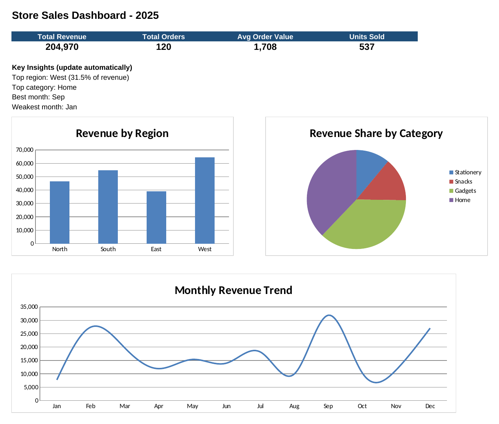

# excel-store-sales-analysis# Store Sales Analysis (Excel)

A simple, beginner-friendly data analytics project built entirely in Microsoft Excel. It analyzes a year of store sales to find which regions, product categories, and months bring in the most revenue.

## Objective
Turn raw sales data into clear insights using Excel formulas and charts.

## Dataset
- 120 fictional orders from 2025
- Columns: Order ID, Date, Region, Category, Product, Quantity, Unit Price, Revenue, Month
- All data is fictional and created for practice. It is not taken from any company or website.

## Workbook Structure
| Sheet | Purpose |
|---|---|
| README | Project overview |
| Dashboard | KPI cards, auto-updating insights, and 3 charts |
| Data | Raw order data with calculated Revenue and Month columns |
| Analysis | Summary tables by region, category, and month |

## Excel Skills Used
- Formulas: `SUMIFS`, `COUNTIFS`, `AVERAGE`, `MAX`, `MIN`, `INDEX/MATCH`, `TEXT`
- Calculated columns (Revenue = Quantity × Unit Price)
- Filters and frozen headers
- Charts: bar, pie, and line
- Dashboard design with KPI cards

## Key Insights
- Total revenue: 204,970 across 120 orders
- Average order value: about 1,708
- **West** is the top region, with 31.5% of total revenue
- **Home** is the top-selling category
- **September** is the best month and **January** is the weakest

## How to Use
1. Download `Store_Sales_Analysis.xlsx`
2. Open it in Microsoft Excel
3. View the **Dashboard** sheet for the summary
4. Change any Quantity or Unit Price on the **Data** sheet and watch everything update automatically

## Dashboard Preview

## Possible Improvements
- Add a PivotTable and slicers for interactive filtering
- Add a profit column and analyze margins
- Compare performance across multiple years

## Author
**Vasireddy JayaBalaji**
[LinkedIn](https://www.linkedin.com/in/vasireddyjayabalaji)
